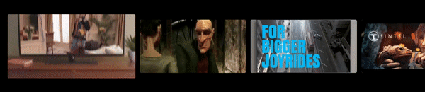

# Preview Card

A composable to show live video previews in Android TV content feeds.



```
@Composable
fun PreviewCard(
    modifier: Modifier = Modifier,
    cardWidth: Dp,
    cardHeight: Dp,
    videoUrl: String,
    hasFocus: Boolean,
    clipStartPosition: Long = 2000000,
    clipEndPosition: Long = 8000000,
    thumbnailFrame: Long = 5000000,
    thumbnailUrl: String? = null
)
```

## How does it work?

Using ExoPlayer and the provided `clipStartPosition` / `clipEndPosition`, when the item `hasFocus` a preview clip
will be shown in the card. When not in focus, the provided thumbnail details will be used to display
a placeholder image.

If the `thumbnailUrl` is provided, this will simply be loaded. Otherwise, a thumbnail will be loaded from the provided `thumbnailFrame`.